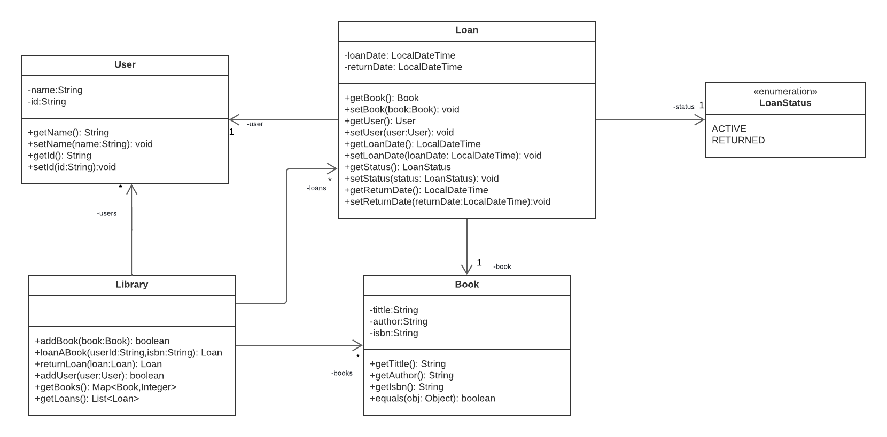
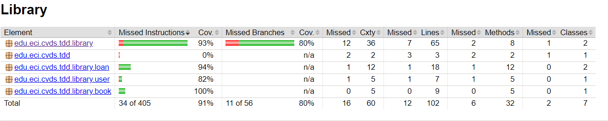
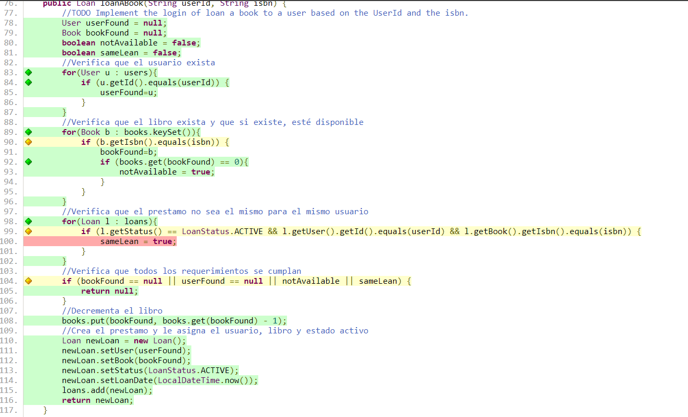

<h1>LABORATORIO 3</h1>

### Jorge Andrés Gamboa Sierra
### Andrea Camila Torres Gonzales

<h2>OBJETIVOS</h2>
<ol>
    <li>Como hacer pruebas unitarias.</li>
    <li>Utilizar anotaciones @Test del framework JUnit</li>
    <li>Aplicar TDD.</li>
</ol>
<h2>INTRODUCCIÓN</h2>
Las pruebas unitarias son una parte esencial en el desarrollo de software, ya que permiten validar la lógica de cada método y contribuir a la creación de un código sólido y robusto. Durante este laboratorio, se utilizará Maven, 
una herramienta muy útil para gestionar dependencias como JUnit, que es fundamental para la ejecución de las pruebas unitarias.
Trabajaremos con una aplicación basada en una biblioteca, que incluye libros, préstamos y usuarios. Implementaremos los métodos correspondientes en la clase Library aplicando la metodología de desarrollo guiado por pruebas (TDD). 
Esta práctica nos ayudará a escribir código enfocado en las pruebas, asegurando así su calidad y fiabilidad.
<h2>MARCO TEÓRICO</h2>

<h2>PROCEDIMIENTO</h2>
<ol>
<li><h3>CREAR PROYECTO CON MAVEN</h3></li>
Para crear el proyecto en maven, nos apoyamos en el arquetipo (archetypes)

```
mvn archetype:generate -DgroupId=edu.eci.cvds -DartifactId=Library -Dpackage=edu.eci.cvds.tdd -DarchetypeArtifactId=maven-archetype-quickstart -DinteractiveMode=false
```

<li><h3>AGREGAR DEPENDENCIA JUNIT5</h3></li>
Para agregar la dependencia, nos vamos al archivo pom.xml y colocamos la siguiente dependencia

```
<dependency>
      <groupId>org.junit.jupiter</groupId>
      <artifactId>junit-jupiter-api</artifactId>
      <version>5.6.0</version>
      <scope>test</scope>
</dependency>
```

Así mismo, cambiamos la versión java. Vamos a la etiqueta <maven.compiler.target> y escribimos la versión 1.8

```
<properties>
    <maven.compiler.target>1.8</maven.compiler.target>
    <maven.compiler.source>1.8</maven.compiler.source>
 </properties>
```

<li><h3>AGREGAR CLASES</h3></li>
Hemos incorporado el código para la aplicación de una biblioteca, la cual se compone de cuatro clases: Library, Book, Loan y User. Además, contamos con la clase LoanStatus, que gestiona los valores constantes para el estado de los préstamos (Loan).
Cada una de estas clases se ha añadido junto con su propio paquete al directorio edu.eci.cvds.tdd.library. La aplicación está diseñada para gestionar los préstamos de la biblioteca, pero inicialmente no incluye la implementación de los métodos addBook, loanABook y returnLoan. Aplicamos ingeniería inversa para realizar el diagrama de clases y entender mejor el funcionamiento de la aplicación.





<li><h3>PRUEBAS UNITARIAS Y TDD</h3>
<ul>
<li><h4>CREAR CLASE DE PRUEBA</h4>
Las pruebas TDD son una parte fundamental en la implementación de los métodos addBook, loanABook y returnLoan. Mediante estas pruebas, podemos identificar posibles casos de fallo y asegurar que cada aspecto de la implementación esté correctamente verificado.

Primero, revisamos detenidamente la documentación de cada método para comprender completamente la lógica y funcionamiento.

A continuación, creamos una clase de prueba denominada LibraryTest, siguiendo el estándar de nomenclatura para clases de prueba. Esta clase contiene las pruebas necesarias para cada método.

Luego, basándonos en las clases de equivalencia, implementamos una prueba para cada partición valor/condición. Por cada prueba escrita, implementamos el código necesario para que la prueba pase. Repetimos este proceso para asegurar que cada prueba esté cubierta y validada adecuadamente.

En total, hemos implementado 20 pruebas, utilizando clases de equivalencia. Esto garantiza que, si una condición/valor en una partición pasa o falla, todos los casos de la misma partición se comporten de manera consistente.
</li>
<li><h4>IMPLEMENTACIÓN DE LOS MÉTODOS</h4>
Presentamos a continuación la implementación final de cada método basado en la metodología de Desarrollo Basado en Pruebas (TDD). Cada método ha sido implementado de acuerdo con los casos de prueba y las especificaciones definidas durante el proceso de TDD, garantizando que cada funcionalidad esté correctamente probada y validada.

<b>AddBook(Book book)</b>

En este método, nos basamos en la sobreescritura (override) de la clase Book, donde se compara el ID del libro actual con el ID que se pasa como parámetro. Basándonos en esto, comparamos los IDs de los libros: si son iguales, se incrementa en 1 la cantidad del libro; en caso contrario, se añade el libro como nuevo y se retorna true.
Además, se establecen algunas restricciones adicionales: si se encuentran valores nulos o libros con atributos nulos o vacíos, la función retorna false.

```
public boolean addBook(Book book) {
        try{
            if (book == null || book.getTittle() == null || book.getTittle().isEmpty() || book.getAuthor() == null || book.getAuthor().isEmpty()
                    || book.getIsbn() == null || book.getIsbn().isEmpty()) {
                return false;
            }
            for(Book b : books.keySet()){
                if (b.equals(book)) {
                    books.put(b, books.get(b) + 1);
                    return true;
                }
            }
            books.put(book, 1);
            return true;
        }catch(Exception e){
            return false;
        }
    }
```
<b>loanABook(Loan loan)</b>

En este método, primero buscamos el usuario en la lista de usuarios que tenga el id proporcionado como parámetro. Si encontramos al usuario, procedemos a verificar los libros disponibles. Buscamos el libro con el id especificado en la lista de libros y comprobamos que esté disponible (es decir, que su cantidad sea mayor a 0).

A continuación, revisamos la lista de préstamos para asegurarnos de que no exista un préstamo activo con el mismo id de usuario y id de libro. Si encontramos un préstamo en estado ACTIVE con los mismos identificadores, significa que el préstamo ya está registrado.

Si alguna de las siguientes condiciones se cumple: el préstamo no existe, el usuario o el libro no se encuentran, el libro no está disponible, o algún valor del parámetro es nulo, devolvemos null. Esto indica que el préstamo no se pudo crear o añadir.

Si todas las condiciones se cumplen correctamente, es decir, el usuario y el libro son válidos, el libro está disponible y no existe un préstamo activo con los mismos identificadores, creamos un nuevo préstamo. Asignamos el usuario y el libro al nuevo préstamo, lo agregamos a la lista de préstamos y lo retornamos.

```
public Loan loanABook(String userId, String isbn) {
        //TODO Implement the login of loan a book to a user based on the UserId and the isbn.
        User userFound = null;
        Book bookFound = null;
        boolean notAvailable = false;
        boolean sameLean = false;
        //Verifica que el usuario exista
        for(User u : users){
            if (u.getId().equals(userId)) {
                userFound=u;
            }
        }
        //Verifica que el libro exista y que si existe, esté disponible
        for(Book b : books.keySet()){
            if (b.getIsbn().equals(isbn)) {
                bookFound=b;
                if (books.get(bookFound) == 0){
                    notAvailable = true;
                }
            }
        }
        //Verifica que el prestamo no sea el mismo para el mismo usuario
        for(Loan l : loans){
            if (l.getStatus() == LoanStatus.ACTIVE && l.getUser().getId().equals(userId) && l.getBook().getIsbn().equals(isbn)) {
                sameLean = true;
            }
        }
        //Verifica que todos los requerimientos se cumplan
        if (bookFound == null || userFound == null || notAvailable || sameLean) {
            return null;
        }
        //Decrementa el libro
        books.put(bookFound, books.get(bookFound) - 1);
        //Crea el prestamo y le asigna el usuario, libro y estado activo
        Loan newLoan = new Loan();
        newLoan.setUser(userFound);
        newLoan.setBook(bookFound);
        newLoan.setStatus(LoanStatus.ACTIVE);
        newLoan.setLoanDate(LocalDateTime.now());
        loans.add(newLoan);
        return newLoan;
    }
```

<b>returnLoan(Loan loan)</b>

En este método, primero verificamos si el préstamo existe buscando en la lista de préstamos y validando su presencia.

Si el préstamo está en estado RETURNED, significa que ya ha sido devuelto anteriormente y, por lo tanto, no necesita ser validado de nuevo.

Si alguna de las siguientes condiciones falla: el préstamo no existe, el préstamo ya ha sido devuelto, o el préstamo es nulo, la función retorna null. Esto indica que el procedimiento para devolver el préstamo no se ha llevado a cabo.

Si todas las condiciones se cumplen correctamente, es decir, el préstamo existe y no ha sido devuelto previamente, cambiamos el estado del préstamo a RETURNED, aumentamos la cantidad del libro correspondiente, y retornamos el préstamo actualizado.

```
public Loan returnLoan(Loan loan) {
//TODO Implement the login of loan a book to a user based on the UserId and the isbn.
boolean exist = false;
boolean isReturned = false;
//Verificar que el prestamo existe
for(Loan l : loans){
if (l.equals(loan)) {
exist = true;
if (l.getStatus() == LoanStatus.RETURNED) isReturned = true;
}
}
if(!exist || isReturned){
return null;
}
Book book = loan.getBook();
if(books.containsKey(book)){
books.put(book, books.get(book) + 1);
}
loan.setStatus(LoanStatus.RETURNED);
loan.setReturnDate(LocalDateTime.now());
return loan;
}
```
</li>
</ul></li>
<li><h3>COBERTURA</h3></li>
Agregamos la dependencia de Jacoco con la última versión reciente al pom.xml. Luego, compilamos el proyecto con Maven usando el comando mvn package y observamos que el archivo index.html se generó en target/site. 
Si lo abrimos, podemos ver un informe detallado de las pruebas realizadas.



El informe indica que tenemos un 91% en "Missed Instructions", lo que significa que la mayoría de las instrucciones están cubiertas por las pruebas.
Además, se muestra un 80% de cobertura en "Missed Branches", lo cual indica que el 80% de los caminos alternativos han sido probados. Para obtener información más detallada, navegamos hacia los enlaces del reporte, donde podemos observar las líneas de código que no han sido del todo probadas por las pruebas.




<li><h3>SONARQUBE</h3></li>
</ol>
<h2>CONCLUSIONES</h2>
<h2>BIBLIOGRAFÍA</h2>
https://adictosaltrabajo.com/2022/10/10/cobertura-en-un-proyecto-maven-multimodulo-con-jacoco/#03
